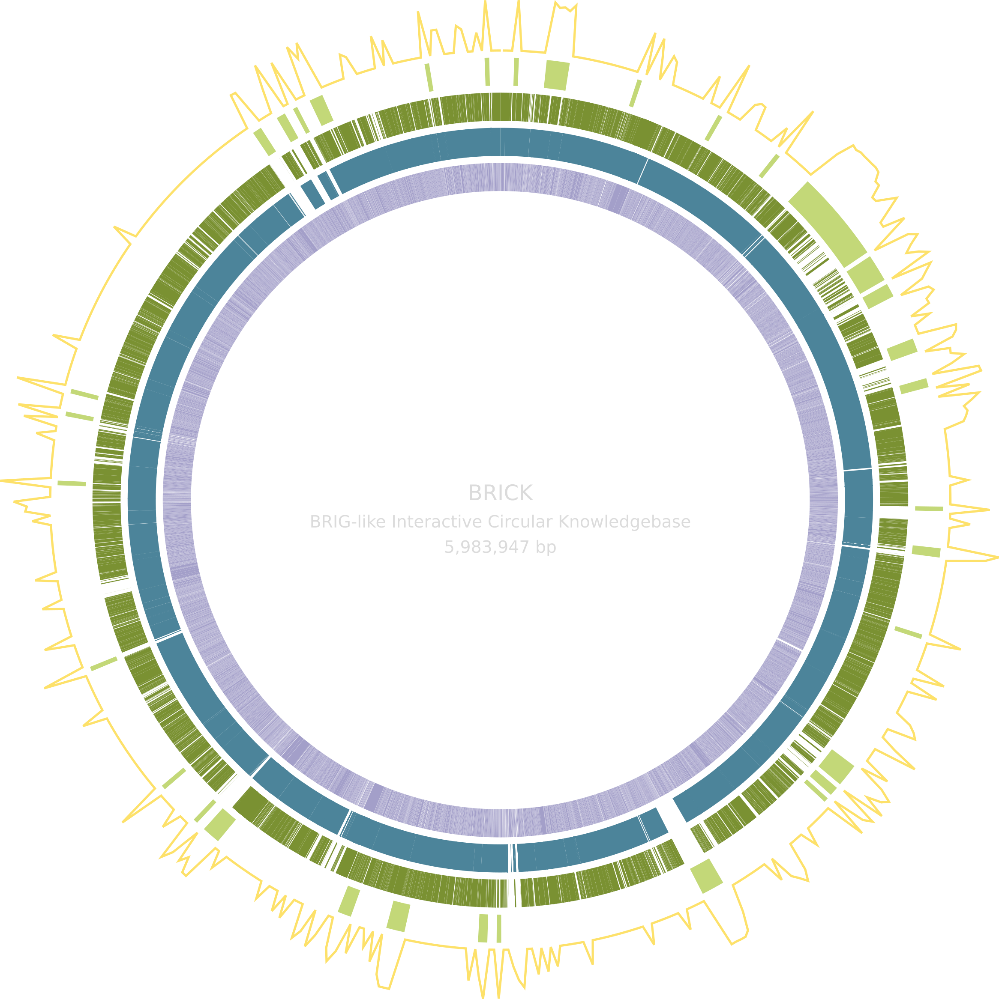

# BRICK <a href='https://github.com/esteinig'></a>

[`BRIG`](https://github.com/happykhan/BRIG)-like interactive data visualization for prokaryotic genome annotation, comparison and exploration of large-scale genomic regions

- [How to run `BRICK`](#web-service-convenient)
  - [Web application](#web-service-convenient) 
  - [Local application (Docker)](#local-application-easy)
  - [Self-hosted application (Docker)](#server-application-advanced)
- [Development setup and workflow](#development)
- [Dependencies and citations](#dependencies)
- [Etymology](#etymology)
- [Contributors](#contributors)

## Web service (convenient)

At the moment, the most convenient way to get started is by using our hosted web application ([brick.ink](https://brick.ink)). Please note that the server is located in Australia - for a snappier experience you can [deploy the application stack](#local-application-easy) on your local machine.

Session visualizations and all session data, including uploaded files and working data expire after seven days and are deleted from database and storage. All data are stored anonymously and sessions can only be accessed using the unique identifier in the URL.

If you notice egregious bugs or styling issues, please [let us know]()! Testing is currently limited to `Linux` and `Firefox`. 

### Files

In the current iteration of the web application there are some restrictions in place:

* File upload size is restricted to 20 MB, please let me know if this is not sufficient
* Files and working data have a total session limit of 200 MB

### Sessions

Don't hesitate to come back to the session - while a session has not expired you can:

* Navigate away at any time and come back to the session using the session URL
* Download the session data and re-hydrate your session in the data upload panel
* Share your (editable) session with colleagues by sending them the session URL

`BRICK` is under active development. Please note there is currently no guarantee for data persistence in the web application or backwards compatabiltity until major version release. 

## Local application (easy)

You can run a pre-configured local production stack of the latest release with `Docker`:

```bash
# Clone latest stable release on main
git clone https://github.com/esteinig/brick && cd brick

# -d for detached mode
docker compose --profile prod up 

# Application available in your browser at: http://localhost:5173/ 
```

Update to the latest stable version on `main`:

```bash
git pull # update main
docker compose --profile prod up --build 
```

## Server application (advanced)

You can self-host the application on a local or remote server - in this case my assumption is that you know what you are doing 👀

<details>

<summary>Expand to view self-hosting instructions</summary>

See the `docker` subdirectory for reverse-proxy and alternative service configurations using `Traefik`. 

If you are hosting your own instance of the application on the web, my assumption is that you know what you are doing and have enough background knowledge to modify `docker/traefik/web/dynamic.yml` and `docker/docker-compose.web.yml`. Please ensure proper attribution if you are running your own web-instance, it helps to keep our main server running :heart:  

Please note that some tools may require adjustments of the `docker/brick.env` application and server configuration file, in particular adjustment of the `BODY_SIZE_LIMIT` variable which controls the maximum size for requests including file uploads, and the `PRIVATE_CELERY_TASK_CHECK_TIMEOUT` variable, which controls how long we are checking for results from a task queue worker that processes a long-running task.

In this example, we are using the pre-configured `localhost` reverse-proxy to test deployment on a local machine (`http://brick.localhost/`), assuming there are no other reverse-proxy service running:

```bash
# Create the external `proxy` network which 
# connects your stack with the reverse-proxy
docker network create proxy

# Link the localhost stack into the current repository
ln -s docker/docker-compose.localhost.yml .
ln -s docker/docker-compose.traefik.localhost.yml .

# Create a secrets directory captured in `.gitignore` 
# and copy the default secret files for the stack database
mkdir .secrets
cp docker/mongodb/* .secrets/

# Modify the secret files, one line per file, line endings are stripped 
# automatically on server start in case you use `nano` or other editors
# that introduce them by default

# Up the reverse proxy service
docker compose -f docker-compose.traefik.localhost.yml up -d

# Up the production stack
docker compose -f docker-compose.localhost.yml up

# Application available in your browser at: http://brick.localhost/
```

The production stack comes with an (optional) database cleaner that safely removes sessions and session working directories in the `work` volume, which can be activated using the `--profile server` flag:

```bash
docker compose --profile prod --profile server up 
```

Default interval (every day) and expiration time (7 days) can be changed in `docker-compose.yml`:

```yml
command: brick utils clean --expire-days 7 --day-of-week "*" --time-of-day '04:00' --log /tmp/brick-cleaner.log
```

If you are running a web-instance through `Cloudflare` you need to set your SSL configuration to `full`. 


</details>

## Development

Any and all questions, suggestions for improvement, bug reports, pull requests and ideas you would like to see implemented are welcome! Please open an [issue](https://github.com/esteinig/brick/issues) in this repository. 

<details>

<summary>Expand to view development notes and workflows</summary>

Development workflows and notes are mainly are reminder to myself and anyone who would like to contribute - if you have any questions please feel free to open an issue or contact me through the usual channels.

Development and pull requests can be made on the [`dev`](https://github.com/esteinig/brick/tree/dev) branch. You can use the `dev` profile for hot reloads of changes to the application interface. Note that the `dev` profile in `docker-compose.web.yml` actually deploys the production service, but on a different domain, to be implemented (`dev.brick.ink`). For hot-reload of the Sveltekit interface the application should be installed first (`npm install`) so that you can point your IDE at the development clone and changes made to the `app` and `node_modules` folder are mirrored into the development container.

Note that the `--profile dev` stack serves the application on port `5174` **not on** `5173` (`--profile prod`) for concurrent production build testing.

It may help to run a fresh development stack with a project identifier to keep volumes and containers separate for the current branch. Project specific stack containers and volumes (all data) can be removed with the `-v` flag. Changes to the `Python` package currently have to use the `--build` flag to rebuild the package inside the `docker/Dockerfile.server` container. 


```bash
# You may be on a new feature branch `feat/new-feature`...

# Up a fresh stack with the `--project` flag for this branch
docker compose --profile dev --project-name new-feature up -d

# Down the stack and remove all volumes 
docker compose --profile dev --project-name new-feature down -v
```

Unit tests are defined in `tests` can be run with the `tests` service:

```bash
# At the moment we need to rebuild after modifying tests
docker compose build tests && docker compose run --rm tests
```

Release branches (`release/**`) can be used to auto bump version and generate the changelog for example by using `git checkout -b release/$(cog bump --dry-run --auto) && cog bump --auto`. I am not sure if `cocogitto` is stable yet, it may be worthwhile checking version bumps before creating the branch with `cog bump --dry-run --auto`. A new PR is created with the updated `CHANGELOG.md` and version bumps from `cocogitto`, which can then be merged into main (`release.yml`).

Releases are deployed to the production server on creation of a new release (`cicd-prod.yml`). Tests are run with the `test.yml` action workflow on push any test branch (`test/**`). One can create a release branch and before merging into `main` simply checkout and push a new test branch of the release to trigger the unit testing action for example `git checkout -b test/0.3.0 && git push origin test/0.3.0`.

</details>

## Dependencies

`BRICK` would not be possible without the relentless work of bioinformaticians and researchers developing open-soource software for the community. 
If you use their tools in the visualization, please cite the following publications:

> [Altschul et al. (1990)](https://pubmed.ncbi.nlm.nih.gov/2231712/) - Basic local alignment search tool - Journal of Molecular Biology

> [Camargo et al. (2023)](https://www.nature.com/articles/s41587-023-01953-y) - Identification of mobile genetic elements with geNomad - Nature Biotechnology

> [Sherry et al. (2023)](https://www.nature.com/articles/s41467-022-35713-4) - An ISO-certified genomics workflow for identification and surveillance of antimicrobial resistance (abritAMR) - Nature Communications

If you would like to acknowledge the authors of the original visualization, please cite:

> [Alikhan et al. (2011)](https://bmcgenomics.biomedcentral.com/articles/10.1186/1471-2164-12-402) - BLAST Ring Image Generator (BRIG): simple prokaryote genome comparisons - BMC Genomics

Similarly, the stack would not be possible without the following wonderful tools:

* [Svelte/Sveltekit](https://kit.svelte.dev/)
* [Skeleton UI](https://www.skeleton.dev/)
* [FastAPI](https://fastapi.tiangolo.com/)
* [Celery](https://docs.celeryq.dev/en/stable/)
* [Redis](https://github.com/redis/redis)
* [MongoDB](https://www.mongodb.com/)

## Etymology

`BRICK` is not very brick-like... and **BR**IG-like **I**nteractive **C**ircular **K**nowledgebase is a bit of a stretch 👀 

## Contributors

* Eike Steinig - [@esteinig](https://github.com/esteinig)
* Wytamma Wirth - [@Wytamma](https://github.com/Wytamma)
